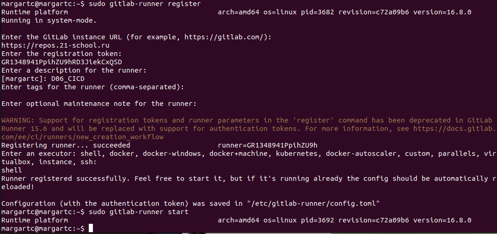
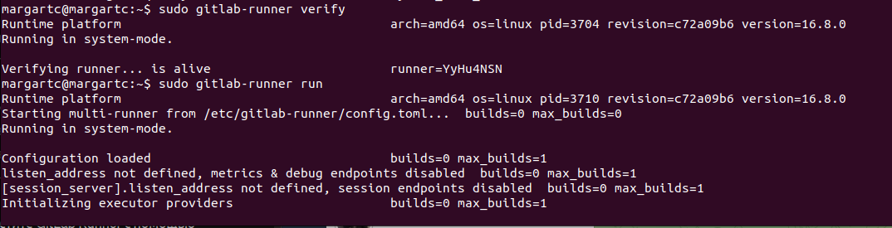
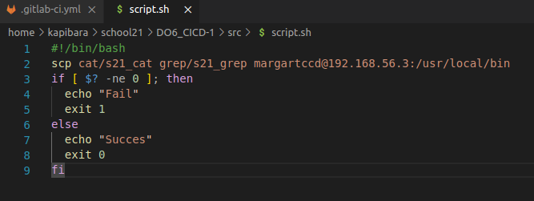

# Basic CI/CD

Разработка простого **CI/CD** для проекта *SimpleBashUtils*. Сборка, тестирование, развертывание.

### Part 1. Настройка **gitlab-runner**

**== Задание ==**

##### Подними виртуальную машину *Ubuntu Server 22.04 LTS*
*Будь готов, что в конце проекта нужно будет сохранить дамп образа виртуальной машины*

##### Скачай и установи на виртуальную машину **gitlab-runner**

##### Запусти **gitlab-runner** и зарегистрируй его для использования в текущем проекте (*DO6_CICD*)
- Для регистрации понадобятся URL и токен, которые можно получить на страничке задания на платформе.

**== Решение ==**

* Установка gitlab-ruuner на виртуалку

curl -L "https://packages.gitlab.com/install/repositories/runner/gitlab-runner/script.deb.sh" | sudo bash

sudo apt-get update

sudo apt-get install gitlab-runner
 
   
 
   

* Регистрация

sudu gitlab-runner register

   
 
   

### Part 2. Сборка

**== Задание ==**

#### Напиши этап для **CI** по сборке приложений из проекта *C2_SimpleBashUtils*:

##### В файле _gitlab-ci.yml_ добавь этап запуска сборки через мейк файл из проекта _C2_

##### Файлы, полученные после сборки (артефакты), сохрани в произвольную директорию со сроком хранения 30 дней.

**== Решение ==**

* Создаю файл .gitlab-ci.yml в корне проекта
* В src копирую cat и grep из проекта "SimpleBash"
 
   

* Пушу проект
* Билд проходит успешно!

   
 
   

* Скачиваю файл с артефактами - все ок!

   

### Part 3. Тест кодстайла

**== Задание ==**

#### Напиши этап для **CI**, который запускает скрипт кодстайла (*clang-format*):

##### Если кодстайл не прошел, то «зафейли» пайплайн

##### В пайплайне отобрази вывод утилиты *clang-format*

**== Решение ==**

* Добавляю статию код-стайла

   

* Код стайл прошел успешно

   

   

   

* Ломаю один из файлов, чтобы не проходил код стайл

   

* Смотрим на ошибки(в нескольких строках содержатся лишние пробелы)

   

### Part 4. Интеграционные тесты

**== Задание ==**

#### Напиши этап для **CI**, который запускает твои интеграционные тесты из того же проекта:

##### Запусти этот этап автоматически только при условии, если сборка и тест кодстайла прошли успешно

##### Если тесты не прошли, то «зафейли» пайплайн

##### В пайплайне отобрази вывод, что интеграционные тесты успешно прошли / провалились

**== Решение ==**

* Добавляю в тест скрипты завершение программы с результатом 1(если фейлов > 0)

   

* Добавляю тестов в ямл

   

* Изначально я писал проект под Мак, тесты имеют некоторые отличия с Линуксом, пришлось редачить несколько тестов

   

* С ошибкой

   

* Успешный

   

* Специально ломаю файл, чтобы он не прошел стадию код стайла, тем самым проверяю, чтобы после фейла код стайла, автоматически не началась проверка стадии тестов

   

* Все отработало успешно

   

### Part 5. Этап деплоя

**== Задание ==**

##### Подними вторую виртуальную машину *Ubuntu Server 22.04 LTS*

#### Напиши этап для **CD**, который «разворачивает» проект на другой виртуальной машине:

##### Запусти этот этап вручную при условии, что все предыдущие этапы прошли успешно

##### Напиши bash-скрипт, который при помощи **ssh** и **scp** копирует файлы, полученные после сборки (артефакты), в директорию */usr/local/bin* второй виртуальной машины

##### В файле _gitlab-ci.yml_ добавь этап запуска написанного скрипта

##### В случае ошибки «зафейли» пайплайн

**== Решение ==**

* Тестирую ручной запуск

   

   

* Создаю ссшник на 1-ой машине

   

* Копирую ссш на вторую машину

   

* До конца не понял какое влияние было от созданиев ссш от рута и раннера(возможно это лишнее, но я допустил ошибку в скрипте, указал не тот ипишник)

   

   

   

* Исправил ошибку в скрипте, стадия проходит успешно

   

* Success выводит!

   

* Сам скрипт

   

### Part 6. Дополнительно. Уведомления

**gitlab-runner**.

**== Задание ==**

##### Настрой уведомления о успешном/неуспешном выполнении пайплайна через бота с именем «[ваш nickname] DO6 CI/CD» в *Telegram*

- Текст уведомления должен содержать информацию об успешности прохождения как этапа **CI**, так и этапа **CD**.
- В остальном текст уведомления может быть произвольным.

**== Решение ==**

* Пишем скрипт(токен и идишник скрыл)

   

* Ямл

   

* Успешное прохождение отработал!

   

* Фейл - отработал!

   

### Спасибо за внимание!