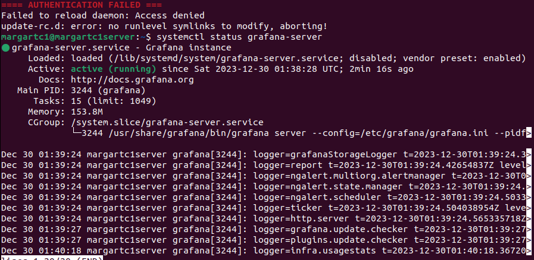

## Part 7. Prometheus и Grafana
Выражаю благодарность автору видео - https://www.youtube.com/watch?v=94JMdueq2SA С помощью его труда, я сделал данный парт
* Запустил нод экспортер(до жтого я уже установил прометеус и запустил его, но забыл делать скрины)

    *старт нод экспортер * 

* Заполнил прометеус ямл и сделал рестарт прометеуса

    *старт прометеус * 

* Графиня старт

    *графиня * 

* Таргет прометеуса

    *прометеус * 

* Дашборд в графиню добавил кодом - 1860
* Метрики графини, сравниваю с метриками htop

    *графиня * 

* Запустил скрипт парта 2 - цпеуха улетела

    *графиня * 

* Нагружаю цпуху стрессом - скачек можно увидеть на грфике

    *графиня * 