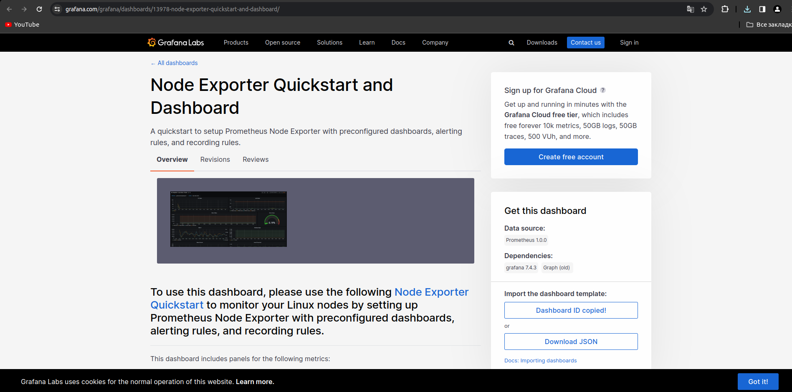
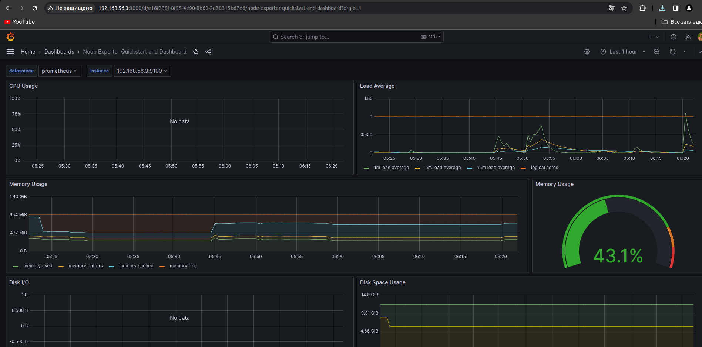
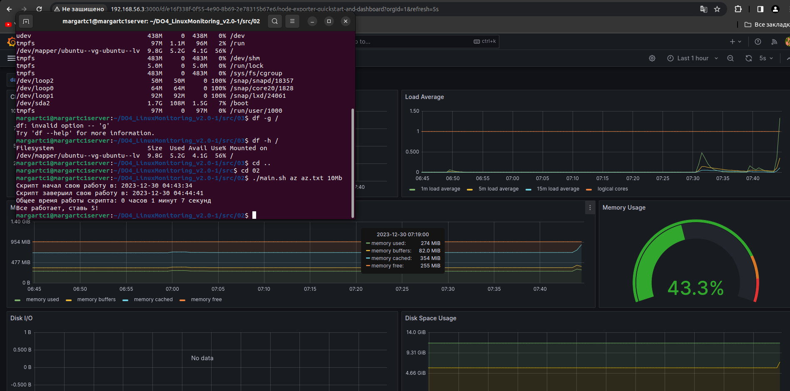
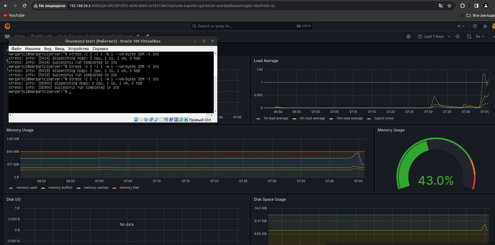
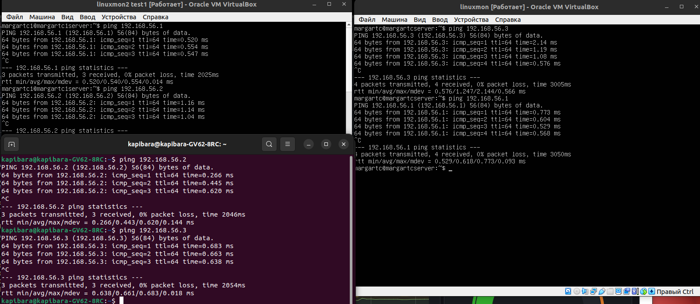
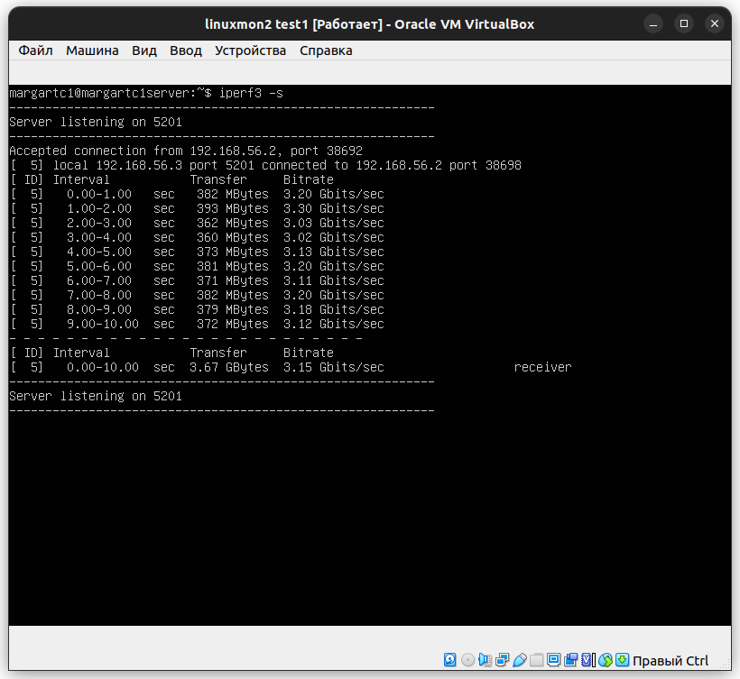
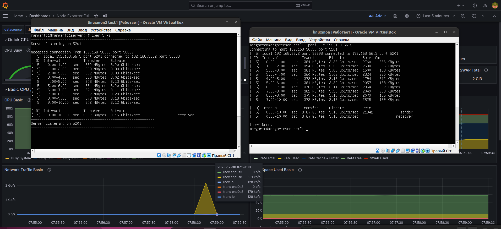

## Part 8. Готовый дашборд

* Установить готовый дашборд Node Exporter Quickstart and Dashboard с официального сайта Grafana Labs

    *Exporter Quickstart and Dashboard * 

* Интерфейс Node Exporter Quickstart and Dashboard 

    *Графиня * 

* Парт 2

    *Графиня * 

* Стресс

    *Графиня * 

* Пингую между обой локалку и две виртуалки

    *Терминальчики* 

* Сервак соединил с виртуалкой

    *Терминальчики* 

* Скачек нетворка

    *Терминальчики* 