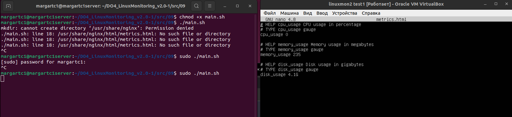
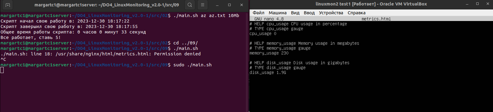
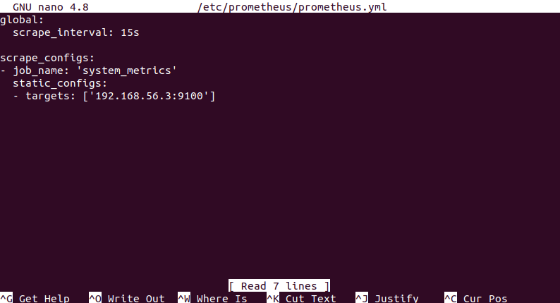
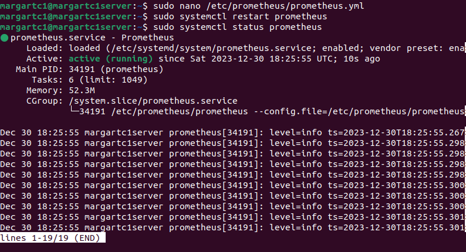
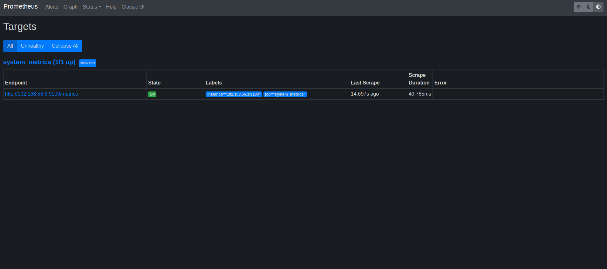
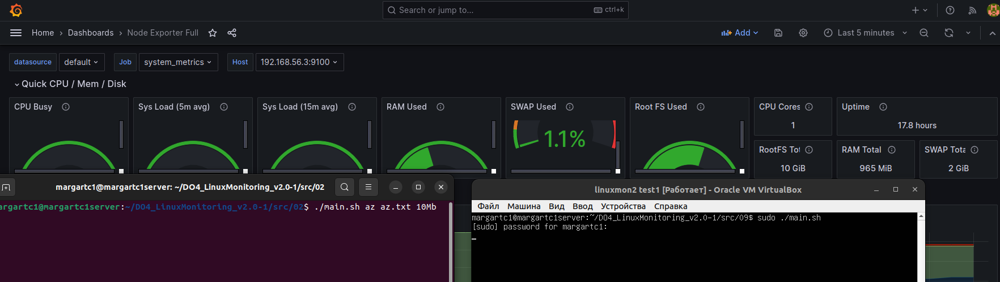
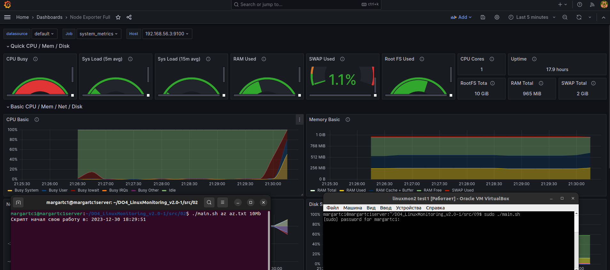
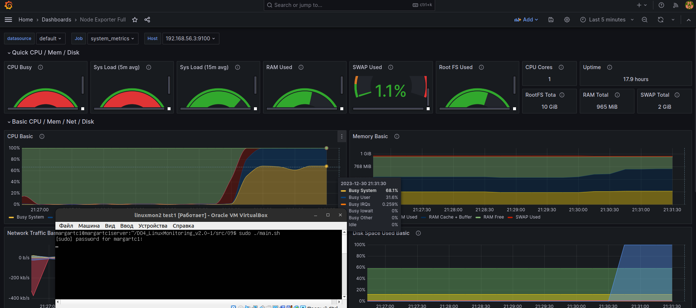

## Part 9. Дополнительно. Свой node_exporter
* Запускаем  **main.sh**

    *Запуск скрипта, метрики на момент запуска * 

* Для примера запустил работу скрипта из парта 2

    *Запуск крипта, метрики после запуска * 

* Редактирую прометеус ямл

    *Prometheus.yml * 

* Перезапускаю работу прометеуса

    *Prometheus.yml * 

* Таргет в прометеусе появился без ошибок

    *Prometheus * 

* Графиня до старта парт2. Скрипт из парт 9 запущен

    *Графиня * 

* Графиня старт парта 2 - цпу сразу скаканул

    *Графиня * 

* Графиня старт парта 2 - память скаканула

    *Графиня * 