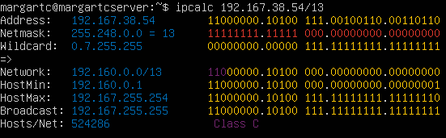
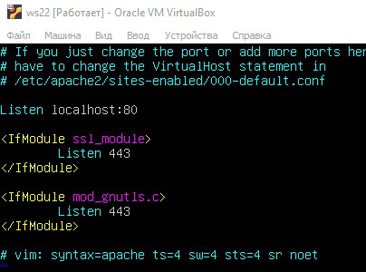

# UNIX/Linux operating systems (Basic) by Almaveno.

Установка и обновления системы Linux. Основы администрирования.

## Part 1. Инструмент ipcalc

### 1.1. Сети и маски
**1) Адрес сети - 192.160.0.0/13** 

    *адрес сети 192.167.38.54/13* 

**2) Перевод маски 255.255.255.0 в префиксную и двоичную запись, /15 в обычную и двоичную, 11111111.11111111.11111111.11110000 в обычную и префиксную**
* перевод маски 255.255.255.0 в префиксную и двоичную запись
>Префиксная = 24

>Двоичная = 11111111.11111111.11111111.00000000

    *Netmask 255.255.255.0* 
* /15 в обычную и двоичную*
>Обычная = 255.254.0.0

>Двоичная = 11111111.11111110.00000000.00000000

    *Netmask /15* 
* 11111111.11111111.11111111.11110000 в обычную и префиксную
>Утилита не принимает на вход число в двоичной системе. В обычную переводим самостоятельно = 255.255.255.240

>Префиксная = 28

    *Netmask 1111...* 

**3) Минимальный и максимальный хост в сети 12.167.38.4 при масках: /8, 11111111.11111111.00000000.00000000, 255.255.254.0 и /4**
* /8
>Min = 12.0.0.1; Max = 12.255.255.254

    *MinMaxHost* 
* 11111111.11111111.00000000.00000000
>Min = 12.167.0.1; Max = 12.167.255.254

    *MinMaxHost* 
* 255.255.254.0
>Min = 12.167.38.1; Max = 12.167.39.254

    *MinMaxHost* 
* /4
>Min = 0.0.0.1; Max = 15.255.255.254

    *MinMaxHost* 

### 1.2. localhost
* Определить и записать в отчёт, можно ли обратиться к приложению, работающему на localhost, со следующими IP: 194.34.23.100, 127.0.0.2, 127.1.0.1, 128.0.0.1
> IP подходят - 127.0.0.2, 127.1.0.1

> IP не подходят - 194.34.23.100, 127.1.0.1

    *194.34.23.100, 127.0.0.2, 127.1.0.1* 

    *128.0.0.1* 

### 1.3. Диапазоны и сегменты сетей
**1) Какие из перечисленных IP можно использовать в качестве публичного, а какие только в качестве частных: 10.0.0.45, 134.43.0.2, 192.168.4.2, 172.20.250.4, 172.0.2.1, 192.172.0.1, 172.68.0.2, 172.16.255.255, 10.10.10.10, 192.169.168.1**
> Публичные: 134.43.0.2, 172.0.2.1, 192.172.0.1, 172.68.0.2, 192.169.168.1

>Частные: 10.0.0.45, 192.168.4.2, 172.20.250.4, 172.16.255.255, 10.10.10.10

   

   

   

   

**2) какие из перечисленных IP адресов шлюза возможны у сети 10.10.0.0/18: 10.0.0.1, 10.10.0.2, 10.10.10.10, 10.10.100.1, 10.10.1.255**
>Возможные IP - 10.0.0.1, 10.10.0.2, 10.10.10.10

>Невозможные IP - 10.10.100.1, 10.10.1.255

   

## Part 2. Статическая маршрутизация между двумя машинами
**1. С помощью команды ip a посмотреть существующие сетевые интерфейсы**

    *ws1 ws2 ip a* 
**2. Описать сетевой интерфейс, соответствующий внутренней сети, на обеих машинах и задать следующие адреса и маски: ws1 - 192.168.100.10, маска /16, ws2 - 172.24.116.8, маска /12**

    */etc/netplan/00-installer-config.yaml* 
**3. Выполнить команду netplan apply для перезапуска сервиса сети**

    *netplan apply* 
### 2.1. Добавление статического маршрута вручную
* Добавить статический маршрут от одной машины до другой и обратно при помощи команды вида ip r add и пропингвать соединение между машинами

    *все в одном скрине* 
### 2.2. Добавление статического маршрута с сохранением
**1. reboot**

**2. Добавить статический маршрут от одной машины до другой с помощью файла etc/netplan/00-installer-config.yaml**

    */etc/netplan/00-installer-config.yaml* 
**3. Пропинговать соединение между машинами**

    *пингую* 
## Part 3. Утилита iperf3
### 3.1. Скорость соединения
**Перевести и записать в отчёт: 8 Mbps в MB/s, 100 MB/s в Kbps, 1 Gbps в Mbps
8 Mbps = 1 MB/s**
* 8 Mbps = 1 MB/s
* 100 MB/s = 819200 Kbps
* 1 Gbps = 1024 Mbps
### 3.2. Утилита iperf3

    *ws1 - iperf3, ws2 - iperf3 -c ipw1* 
## Part 4. Сетевой экран
### 4.1. Утилита iptables
**1. Добавил правила по заданию**

    */etc/firewall.sh* 
**2. Запустить файлы на обеих машинах командами chmod +x /etc/firewall.sh и /etc/firewall.sh**

    *запускаю /etc/firewall.sh* 
**3. В отчёте описать разницу между стратегиями, применёнными в первом и втором файлах.**
>Будет применяться только второе правило, так как оно перезаписывает первое.
### 4.2. Утилита nmap
**Командой ping найти машину, которая не "пингуется", после чего утилитой nmap показать, что хост машины запущен**

    *пингую и nmap* 

## Part 5. Статическая маршрутизация сети

### 5.1. Настройка адресов машин
**1.Настроить конфигурации машин в etc/netplan/00-installer-config.yaml согласно сети на рисунке.**

    *menu VB* 

    *скрины с содержанием файла etc/netplan/00-installer-config.yaml для каждой машины* 

**2.Перезапустить сервис сети. Если ошибок нет, то командой ip -4 a проверить, что адрес машины задан верно. Также пропинговать ws22 с ws21. Аналогично пропинговать r1 с ws11.**

    *ip -4 a* 

    *пропинговать ws22 с ws21. Аналогично пропинговать r1 с ws11* 

### 5.2. Включение переадресации IP-адресов.

**1.Для включения переадресации IP, выполните команду на роутерах:**

    *sysctl -w net.ipv4.ip_forward=1* 

**2.Откройте файл /etc/sysctl.conf и добавьте в него следующую строку: ...**

    */etc/sysctl.conf.* 

### 5.3. Установка маршрута по-умолчанию

**1.Настроить маршрут по-умолчанию (шлюз) для рабочих станций. Для этого добавить default перед IP роутера в файле конфигураций.**

    *default* 

**2.Вызвать ip r и показать, что добавился маршрут в таблицу маршрутизации**

    *ip r* 

**3.Пропинговать с ws11 роутер r2 и показать на r2, что пинг доходит. Для этого использовать команду:**

    *tcpdump -tn -i eth1* 

### 5.4. Добавление статических маршрутов

**1.Добавить в роутеры r1 и r2 статические маршруты в файле конфигураций. Пример для r1 маршрута в сетку 10.20.0.0/26:**

    *etc/netplan/00-installer-config.yaml* 
**2.Вызвать ip r и показать таблицы с маршрутами на обоих роутерах. Пример таблицы на r1:**

    *ip r* 
**3.Запустить команды на ws11:**

    *ws11* 

### 5.5. Построение списка маршрутизаторов
**Запустить на r1 команду дампа. При помощи утилиты traceroute построить список маршрутизаторов на пути от ws11 до ws21**

    *tcpdump и traceroute* 

Как работает traceroute. Traceroute отправляет по цепочке в направлении конечного сервера три пакета данных с параметром TTL=1. Этот параметр означает, сколько узлов могут пройти пакеты, и с каждым узлом связи уменьшается на 1. Узел, который получает пакеты с TTL=0 возвращает компьютеру сообщение, что дальше они идти не могут. Traceroute фиксирует адрес узла, а также время прохождения каждого пакета туда и обратно.

Дальше traceroute снова отправляет три пакета, но уже с TTL=2. Первый узел уменьшает TTL и отправляет их на следующий узел. Затем всё повторяется с TTL=3, TTL=4 и так пока пакеты не достигнут цели. Когда пакеты доходят до конечного узла и он возвращает сообщение, что дальше пакеты идти не могут, трассировка считается завершённой.

### 5.6. Использование протокола ICMP при маршрутизации

**Запустить на r1 перехват сетевого трафика, проходящего через eth0 с помощью команды. Пропинговать с ws11 несуществующий IP (например, 10.30.0.111) с помощью команды.**

    *tcpdump -n -i eth0 icmp/ping -c 1 10.30.0.111* 

## Part 6. Динамическая настройка IP с помощью DHCP

**Для r2 настроить в файле /etc/dhcp/dhcpd.conf конфигурацию службы DHCP:**

### 1)указать адрес маршрутизатора по-умолчанию, DNS-сервер и адрес внутренней сети. Пример файла для r2:

    *r2* 

### 2)в файле resolv.conf прописать nameserver 8.8.8.8.

    *resolv.conf* 

**Перезагрузить службу DHCP командой systemctl restart isc-dhcp-server. Машину ws21 перезагрузить при помощи reboot и через ip a показать, что она получила адрес. Также пропинговать ws22 с ws21.**

    *isc* 

    *adaters* 

    *ping* 

**Указать MAC адрес у ws11, для этого в etc/netplan/00-installer-config.yaml надо добавить строки: macaddress: 10:10:10:10:10:BA, dhcp4: true**

    *mac* 

**Для r1 настроить аналогично r2, но сделать выдачу адресов с жесткой привязкой к MAC-адресу (ws11). Провести аналогичные тесты**

    *r1* 

    *r1* 

    *r1* 

    *ws11* 

    *ws11* 

**Запросить с ws21 обновление ip адреса**

    *ws21* 
   
    subnet 10.20.0.0 netmask 255.255.255.192 {
    range 10.20.0.2 10.20.0.50; - диапазон доступных IP адресов
    option routers 10.20.0.1; - адрес шлюза маршрутизатора
    option domain-name-servers 10.20.0.1; - IP адресс DNS-сервера
    }

## Part 7. **NAT**

**== Задание ==**

*В данном задании используются виртуальные машины из Части 5*
##### В файле */etc/apache2/ports.conf* на ws22 и r1 изменить строку `Listen 80` на `Listen 0.0.0.0:80`, то есть сделать сервер Apache2 общедоступным
- В отчёт поместить скрин с содержанием изменённого файла.

##### Запустить веб-сервер Apache командой `service apache2 start` на ws22 и r1
- В отчёт поместить скрины с вызовом и выводом использованной команды.

##### Добавить в фаервол, созданный по аналогии с фаерволом из Части 4, на r2 следующие правила:
##### 1) Удаление правил в таблице filter - `iptables -F`
##### 2) Удаление правил в таблице "NAT" - `iptables -F -t nat`
##### 3) Отбрасывать все маршрутизируемые пакеты - `iptables --policy FORWARD DROP`
##### Запускать файл также, как в Части 4
##### Проверить соединение между ws22 и r1 командой `ping`
*При запуске файла с этими правилами, ws22 не должна "пинговаться" с r1*
- В отчёт поместить скрины с вызовом и выводом использованной команды.

##### Добавить в файл ещё одно правило:
##### 4) Разрешить маршрутизацию всех пакетов протокола **ICMP**
##### Запускать файл также, как в Части 4
##### Проверить соединение между ws22 и r1 командой `ping`
*При запуске файла с этими правилами, ws22 должна "пинговаться" с r1*
- В отчёт поместить скрины с вызовом и выводом использованной команды.

##### Добавить в файл ещё два правила:
##### 5) Включить **SNAT**, а именно маскирование всех локальных ip из локальной сети, находящейся за r2 (по обозначениям из Части 5 - сеть 10.20.0.0)
*Совет: стоит подумать о маршрутизации внутренних пакетов, а также внешних пакетов с установленным соединением*
##### 6) Включить **DNAT** на 8080 порт машины r2 и добавить к веб-серверу Apache, запущенному на ws22, доступ извне сети
*Совет: стоит учесть, что при попытке подключения возникнет новое tcp-соединение, предназначенное ws22 и 80 порту*
- В отчёт поместить скрин с содержанием изменённого файла.

##### Запускать файл также, как в Части 4
*Перед тестированием рекомендуется отключить сетевой интерфейс **NAT** (его наличие можно проверить командой `ip a`) в VirtualBox, если он включен*
##### Проверить соединение по TCP для **SNAT**, для этого с ws22 подключиться к серверу Apache на r1 командой:
`telnet [адрес] [порт]`
##### Проверить соединение по TCP для **DNAT**, для этого с r1 подключиться к серверу Apache на ws22 командой `telnet` (обращаться по адресу r2 и порту 8080)
- В отчёт поместить скрины с вызовом и выводом использованных команд.

## Part 8. Дополнительно. Знакомство с **SSH Tunnels**

**== Задание ==**

*В данном задании используются виртуальные машины из Части 5*

##### Запустить на r2 фаервол с правилами из Части 7

##### Запустить веб-сервер **Apache** на ws22 только на localhost (то есть в файле */etc/apache2/ports.conf* изменить строку `Listen 80` на `Listen localhost:80`)

##### Воспользоваться *Local TCP forwarding* с ws21 до ws22, чтобы получить доступ к веб-серверу на ws22 с ws21

##### Воспользоваться *Remote TCP forwarding* c ws11 до ws22, чтобы получить доступ к веб-серверу на ws22 с ws11

