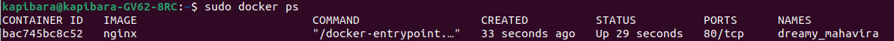

# Simple Docker
## Part 1. Готовый докер
* Установка докера
 
   

* Проверка докера

   

*  Зупускаем докер

   

* Контейнер запущен

   

* Инфа о контейнере 

   

* Размер контейнера, порты, Ип

   

* Остановим докер, запустим докер с нужными портами

   

* Смотрим, что порты соответствуют

   

* Локалхост 80 выдает нужную страницу

   

* Перезапускаем докер и смотрим, что он работает

   

## Part 2. Операции с контейнером

* Читаю конфиг файл внутри контейнера

   

* Создаю сфой конфиг и настраиваю в нем путь 

   

* Копирую файл внутрь докера и перезапускаю

   

* Чекаем локалхост

   

* Экспорт контейнера и остановка

   

* Удаляю образ. Удаляю контейнер

   

* Импортирую контейнер. Запускаю

   

* Чек локалхост

   

## Part 3. Мини веб-сервер
* Сишка

   

* Запусткаем - не работает( Почему? Мы еще ничего не сделали...

   

* Мой конфиг

   

* Запустим новый контейнер

   

* Копируем. Заходим в контейнер

   

* Устанавливаем фджиай 

   

* Компилим пргу и спавним на нужный порт

   

* О чудо! 

   

* Перезапускаю докер

   

* Положи файл nginx.conf по пути ./nginx/nginx.conf (это понадобится позже) - это уже сдеал

   

## Part 4. Свой докер

* Файлики

   
* Ранчик

   
* Докер

   
* Билдим 

   

   
* Докер собрался

   
* Мапинг

   
* Проксирование странички

   
* Перезапускаем нгинх

   
* Чек локалхост

   

## Part 5. Dockle

* Установка докля

   

   

* Чекаем предыдущий обра доклем. Ошибочкиии...

   

* Исправляем ошибки. Создал новый контейнер

   

* Сношу старый

   

* Новый появился

   

* Докль не выдает ошибок

   

## Part 6. Базовый Docker Compose

* Устанавливаю докер композ

   

   
* Стопим мои контейнеры

   
* Меняем конфиг

* Билдим

   
* Поднимаем

   
* Проверяем

   